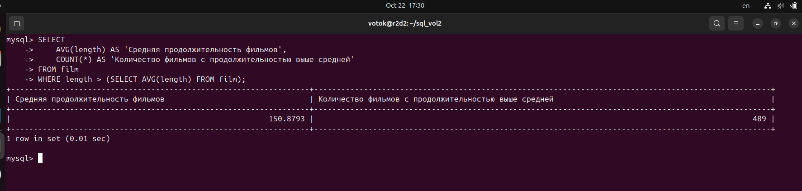
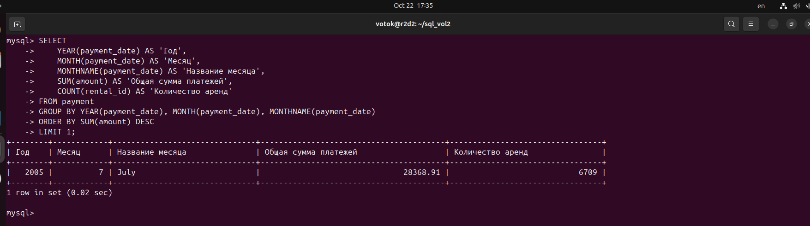
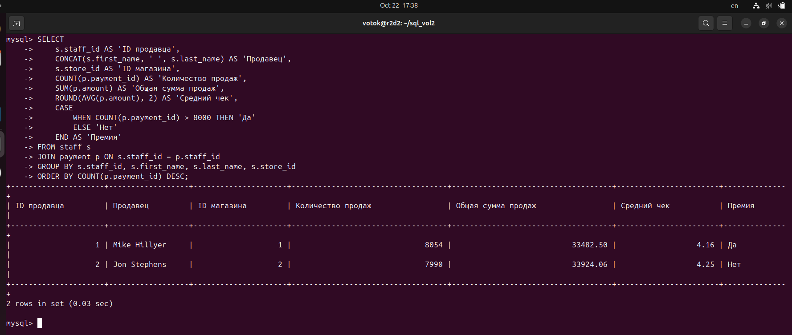
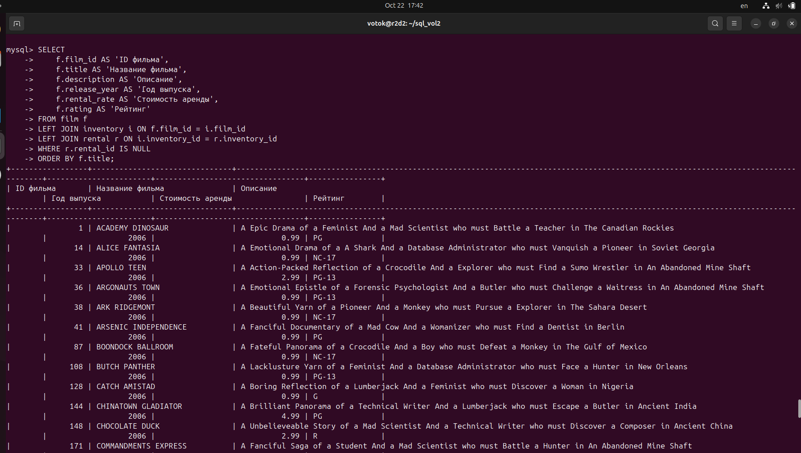
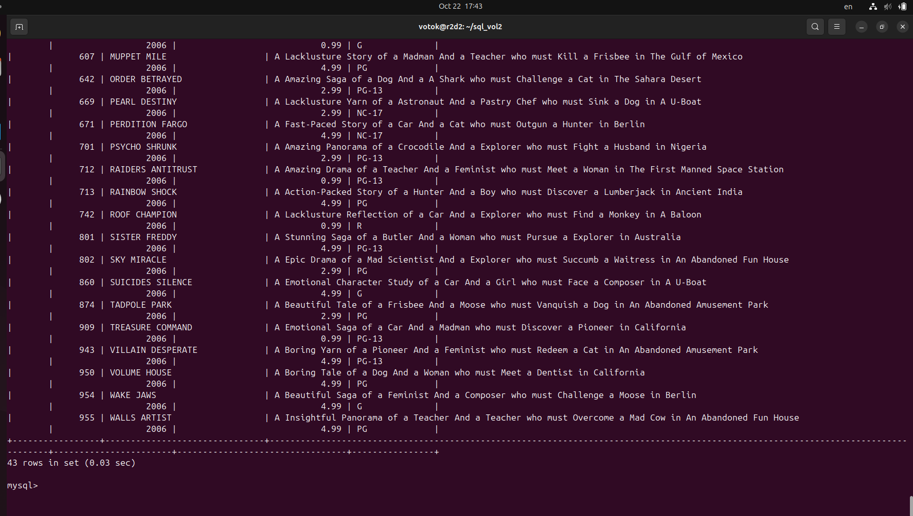

# Домашнее задание к занятию "SQL. Часть 2" - Котов Г.И.

### Задание 1
Одним запросом получите информацию о магазине, в котором обслуживается более 300 покупателей, и выведите в результат следующую информацию:

- фамилия и имя сотрудника из этого магазина;
- город нахождения магазина;
- количество пользователей, закреплённых в этом магазине.

### Решение 1: 

### Задание 2

Получите количество фильмов, продолжительность которых больше средней продолжительности всех фильмов.

### Решение 2: 

### Задание 3

Получите информацию, за какой месяц была получена наибольшая сумма платежей, и добавьте информацию по количеству аренд за этот месяц.

### Решение 3: 

### Задание 4

Посчитайте количество продаж, выполненных каждым продавцом. Добавьте вычисляемую колонку «Премия». Если количество продаж превышает 8000, то значение в колонке будет «Да», иначе должно быть значение «Нет».

### Решение 4: 

### Задание 5

Найдите фильмы, которые ни разу не брали в аренду.

### Решение 5: 

